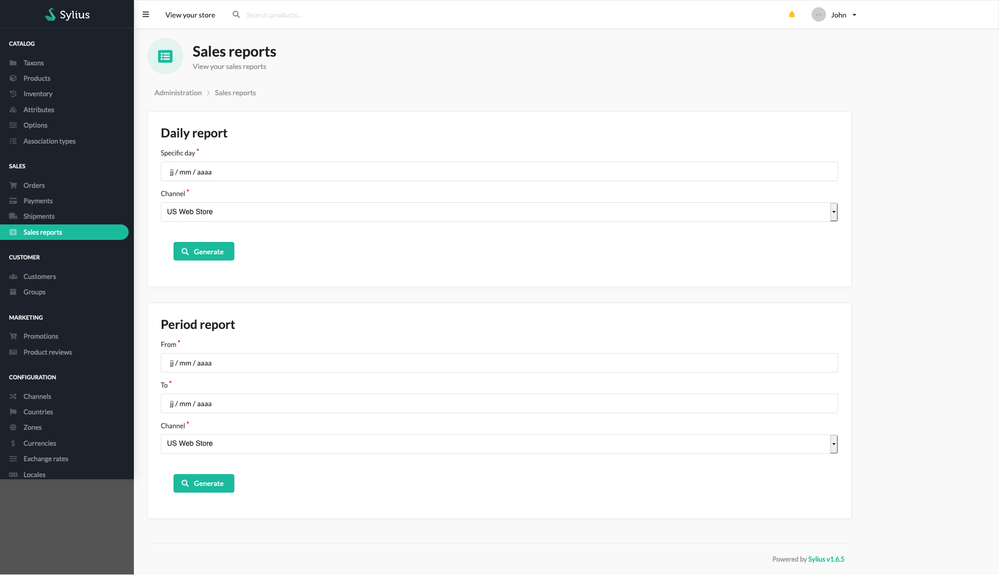
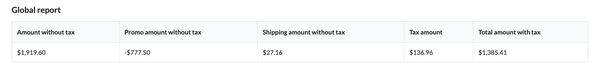
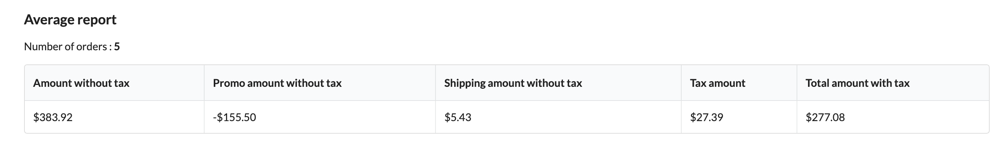
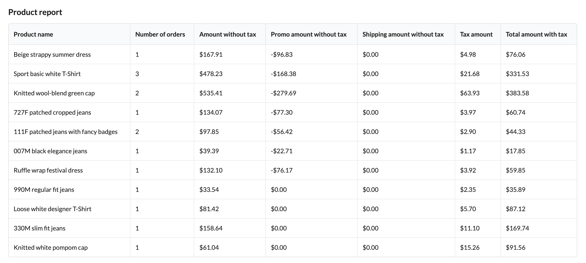
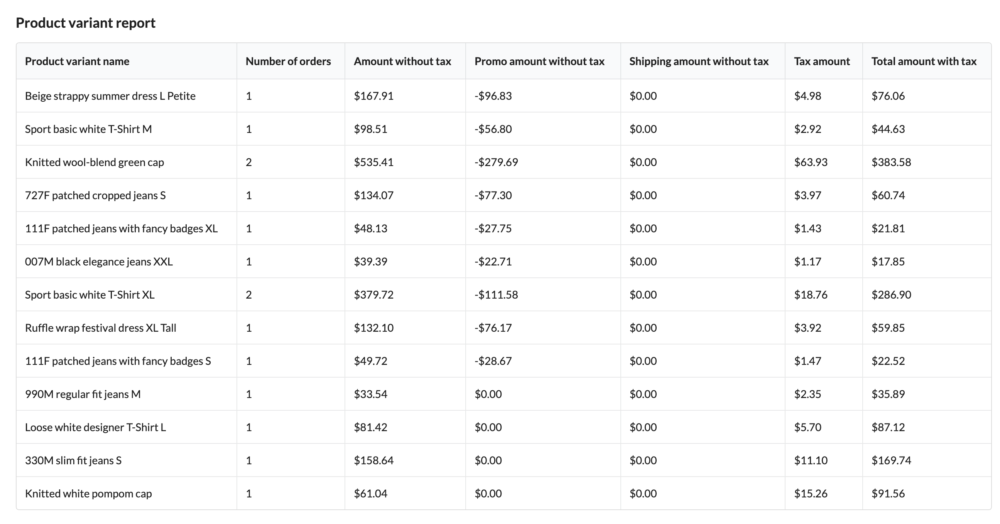
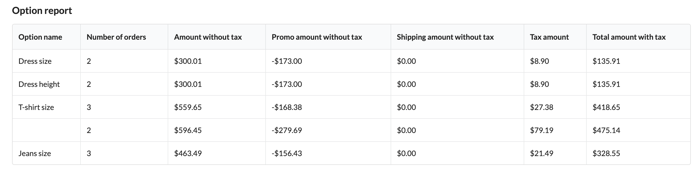
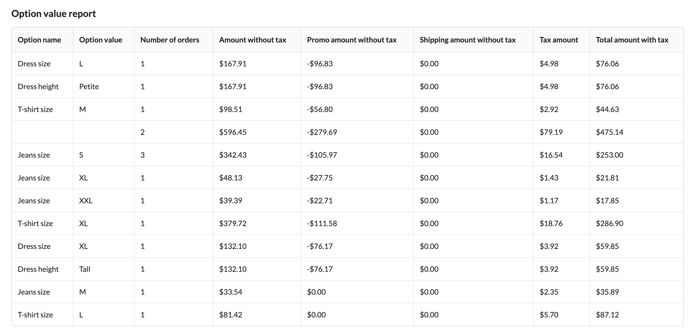

[](https://monsieurbiz.com/agence-web-experte-sylius)

<h1 align="center">Sylius Sales Reports</h1>

[](https://github.com/monsieurbiz/SyliusSalesReportsPlugin/blob/master/LICENSE.txt)
[](https://github.com/monsieurbiz/SyliusSalesReportsPlugin/actions?query=workflow%3ATests)
[](https://github.com/monsieurbiz/SyliusSalesReportsPlugin/actions?query=workflow%3ASecurity)
[](https://github.com/monsieurbiz/SyliusSalesReportsPlugin/actions?query=workflow%3ASecurity)


A simple plugin to have sales reports in Sylius



## Compatibility

| Sylius Version | PHP Version     |
|----------------|-----------------|
| 1.12           | 8.1 - 8.2 - 8.3 |
| 1.13           | 8.1 - 8.2 - 8.3 |
| 1.14           | 8.1 - 8.2 - 8.3 |

## Installation

If you want to use our recipes, you can configure your composer.json by running:

```bash
composer config --no-plugins --json extra.symfony.endpoint '["https://api.github.com/repos/monsieurbiz/symfony-recipes/contents/index.json?ref=flex/master","flex://defaults"]'
```

```bash
composer require monsieurbiz/sylius-sales-reports-plugin
```

Change your `config/bundles.php` file to add the line for the plugin : 

```php
<?php

return [
    //..
    MonsieurBiz\SyliusSalesReportsPlugin\MonsieurBizSyliusSalesReportsPlugin::class => ['all' => true],
];
```

Finally import the routes in `config/routes/monsieurbiz_sylius_sales_reports_plugin.yaml` : 

```yaml
monsieurbiz_sales_reports_plugin:
    resource: "@MonsieurBizSyliusSalesReportsPlugin/Resources/config/routing.yaml"
```

## Reports

All reports columns are sortable by clicking on it.

### Global sales report



### Average sales report



### Product report



### Product variant report



### Option report



### Option value report



### Add your custom reports !

An event is available to add your custom reports, see `CustomReportEvent` class in the plugin.

## Contributing

You can open an issue or a Pull Request if you want! 😘  
Thank you!
